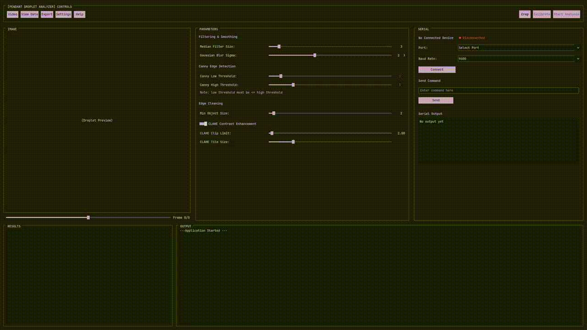

# Droplet Analyzer: Pendant Drop Tensiometry Software


## Project Overview
**Droplet Analyzer** is a Python-based application developed as part of a **Senior Design Project at California State Polytechnic University, Pomona**.

This software provides a user-friendly interface for performing **Pendant Drop Tensiometry**, a method used to determine the surface tension of a liquid by analyzing the shape of a droplet hanging from a needle. By utilizing edge detection algorithms and iteratively fitting the **Young-Laplace equation** to the droplet's profile, the system calculates surface tension, volume, and the Bond number in real-time.

The project integrates computer vision (OpenCV) with hardware control (Arduino) to automate droplet dispensing and lighting.

Because commercial pendant drop tensiometers are expensive and inaccessible, our droplet analyzer aims to be an accessible and easy way to perform pendant drop tensiometry at a highly accurate level. The edge detection is forgiving, and optimization allows for the software to detect a complete edge even given an inoptimal image.

---

## nterface



---

## Key Features

### Software
* **Dual Input Modes:** Analyze pre-recorded video files (`.mov`, `.mp4`) or stream directly from a USB camera or webcam.
* **Computer Vision Pipeline:**
    * **Canny Edge Detection:** Edge finding with adjustable thresholds.
    * **Morphological Filtering:** `bwareaopen` implementation to remove noise and artifacts.
    * **Sub-pixel Precision:** Curve fitting to detect the droplet apex and curvature.
* **Physics Engine:**
    * Solves the Young-Laplace differential equations using `scipy.integrate`.
    * Uses `scipy.optimize.least_squares` to fit theoretical profiles to the observed droplet.
    * Calculates **Surface Tension (mN/m)**, **Volume (mL)**, and **Apex Radius**.
* **Modern GUI:** Built with `CustomTkinter`
* **Data Plotting and Export:** Export edge coordinates and calculated results to CSV/Excel, or plot them in the app.

### Hardware Integration (Arduino)
* **Automated Dispensing:** Control stepper motors to dispense precise droplet volumes via Serial connection.
* **Lighting Control:** Adjust background LED intensity via software or physical potentiometer.
* **Motor Control:** Integrated controls for syringe pumps and frame movement.

---

## Installation

### Prerequisites
* Python 3.8 or higher
* Arduino IDE (for flashing the microcontroller)

### Python Setup
1.  Clone the repository:
    ```bash
    git clone [https://github.com/jhsu22/droplet-analyzer.git](https://github.com/jhsu22/droplet-analyzer.git)
    cd droplet-analyzer
    ```

2.  Install the required dependencies:
    ```bash
    pip install -r requirements.txt
    ```

### Hardware Setup (Arduino)

**Note:** The software supports sending serial commands to any serial connected device, but code for an Arduino setup is included.

1.  Connect your Arduino with an **Adafruit Motor Shield**.
2.  Open `arduino_code.ino` in the Arduino IDE.
3.  Install the required libraries via Library Manager:
    * `Adafruit Motor Shield V2 Library`
    * `PWMServo`
4.  Flash the code to the board.
5.  **Pinout Configuration:**
    * **Stepper 1 (M1/M2):** Syringe Pump
    * **Stepper 2 (M3/M4):** Frame Movement
    * **Pin 9:** LED Backlight
    * **Pin A0:** Potentiometer (Manual LED control)

## Project Structure

```text
droplet-analyzer/
├── arduino_code.ino       # Firmware for motor/LED control
├── requirements.txt       # Python dependencies
├── assets/                # Fonts and themes
├── src/
│   ├── main.py            # Application entry point & GUI loop
│   ├── ui_builder.py      # CustomTkinter layout and widget definitions
│   ├── image_processing.py# OpenCV pipeline & Canny logic
│   ├── young_laplace.py   # Physics math & ODE solvers
│   ├── serial_manager.py  # Threaded serial communication
│   └── config.py          # Global constants and paths
└── README.md
